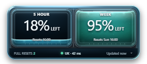
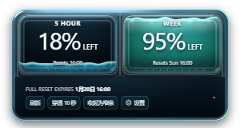
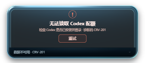

# Codex Meter

<p align="center">
  
</p>

_Windows 11 上的轻量 Codex 配额桌面浮窗。_

---

Codex Meter 通过本机 Codex `app-server` 读取只读配额数据，在一个可拖动的液态玻璃浮窗中并列展示 **5 小时额度**和**一周额度**。应用手动启动、常驻通知区域，不创建开机启动项，也不会占用普通任务栏位置。

> [!IMPORTANT]
> Codex Meter 是非官方社区项目，与 OpenAI 或 ChatGPT 无隶属、赞助或背书关系。



_图 1：Codex Meter 正常状态；截图使用测试数据，不包含真实账号或配额信息。_

## ✨ 主要功能

- 以同等视觉层级展示 5 小时和一周剩余额度
- 液体高度随剩余百分比线性变化
- 每 60 秒自动刷新，也可在展开视图中手动刷新
- 展示额度重置时间和可用完整重置次数
- 支持紧凑、展开和窄条三种布局
- 支持窗口拖动惯性和独立液体晃动
- 支持 10 秒鼠标穿透、透明度调节和减少动效
- 关闭窗口后隐藏到 Windows 通知区域，可从托盘重新显示或退出
- 数据读取失败时保留最近一次有效数据，并显示稳定诊断码

## 🖼️ 界面状态

| 紧凑视图 | 展开视图 | 失败状态 |
| --- | --- | --- |
|  |  |  |

其他确定性测试状态包括[加载状态](docs/verification/screenshots/v8-half-loading.png)和[窄条状态](docs/verification/screenshots/v8-half-collapsed.png)。这些截图均使用测试夹具生成。

## 🚀 安装与使用

Codex Meter 当前以 Windows x64 便携目录运行，不需要安装器。

### 运行要求

- Windows 11 x64
- 当前 Windows 用户已经登录 Codex
- 完整解压便携包，不要只复制可执行文件

便携目录必须保持以下结构：

```text
CodexMeter-<版本>-win-x64/
├── Codex Meter.exe
├── codex-runtime/
└── webview2-runtime/
```

### 启动步骤

1. 完整解压便携包
2. 双击 `Codex Meter.exe`
3. 在浮窗非按钮区域按住鼠标左键拖动窗口
4. 点击右下角箭头展开详情、刷新、穿透或显示设置
5. 关闭浮窗后，通过 Windows 通知区域图标重新显示或退出程序

应用不会自动开机启动。重新启动 Windows 后，需要再次手动运行 `Codex Meter.exe`。

## 🔐 数据与隐私

Codex Meter 启动独立的本机 Codex `app-server` 进程，通过只读 JSON-RPC 请求获取账号配额。认证和网络通信仍由官方 Codex 运行时处理。[^codex-app-server]

应用不会：

- 读取其他进程的内存
- 读取浏览器 Cookie 或登录令牌
- 要求 `.env`、API Key 或个人访问令牌
- 修改账号状态或自动使用完整重置次数
- 将配额、日志或配置上传到第三方服务

本地仅保存窗口位置、透明度和减少动效等显示偏好。

## 🛠️ 从源码运行

### 开发环境

- Node.js 24
- Rust MSVC 工具链
- Visual Studio C++ Build Tools
- Tauri 2 所需的 Windows 构建组件[^tauri-prerequisites]

在 PowerShell 中运行：

```powershell
npm.cmd ci
npm.cmd run tauri:dev
```

开发构建默认使用测试夹具。需要连接当前用户的真实 Codex 账号时：

```powershell
$env:CODEX_CREDITS_USE_LIVE = "1"
npm.cmd run tauri:dev
```

### 运行检查

```powershell
npm.cmd run typecheck
npm.cmd run test
npm.cmd run build
cargo clippy --manifest-path src-tauri\Cargo.toml --all-targets -- -D warnings
cargo test --manifest-path src-tauri\Cargo.toml
```

### 构建便携包

先下载并验证 Microsoft WebView2 Fixed Version Runtime：

```powershell
powershell.exe -NoProfile -ExecutionPolicy Bypass `
  -File scripts\fetch-webview2-fixed-runtime.ps1
```

然后构建应用并生成便携目录：

```powershell
npm.cmd run tauri:build
powershell.exe -NoProfile -ExecutionPolicy Bypass `
  -File scripts\package-portable.ps1
powershell.exe -NoProfile -ExecutionPolicy Bypass `
  -File scripts\verify-portable-brand.ps1
```

输出位于 `release/CodexMeter-<版本>-win-x64/`。请将整个目录压缩后作为 GitHub Release 附件发布，不要把运行时或构建产物提交进源码仓库。

## 🧱 技术组成

| 层 | 技术 | 职责 |
| --- | --- | --- |
| 桌面外壳 | Tauri 2、Rust | 窗口、托盘、进程生命周期和 JSON-RPC |
| 用户界面 | React 19、TypeScript、Vite | 配额状态、交互、设置和错误恢复 |
| 材质与动效 | WebGL2、GLSL | 光学舱体、体积液体、折射和惯性反馈 |
| 配额数据 | `@openai/codex` | 本机 `app-server` 和账号配额接口 |
| 渲染运行时 | Microsoft Edge WebView2 | Windows WebView 渲染 |

项目固定使用已经验证的 Codex 和 WebView2 运行时版本，以减少不同机器之间的协议及渲染差异。

## 🩺 常见问题

### 显示“无法读取 Codex 配额”

确认当前 Windows 用户已经登录 Codex，然后在展开视图中点击“重试”。如果仍然失败，请记录界面上的 `CRV-xxx` 诊断码。

### 双击后提示缺少 WebView2

请使用完整便携包，并确认 `webview2-runtime` 与 `Codex Meter.exe` 保持同级。不要单独移动 EXE。

### 关闭窗口后程序仍在运行

这是预期行为。关闭按钮只会把浮窗隐藏到通知区域；需要完全退出时，请右键通知区域图标并选择“退出”。

### 鼠标无法操作浮窗

可能启用了临时穿透模式。等待 10 秒后会自动恢复。

## 🤝 参与贡献

欢迎提交 Issue 和 Pull Request。问题报告请包含 Windows 版本、复现步骤和诊断码；请勿公开上传令牌、日志、账号截图或其他敏感信息。

提交代码前，请运行“运行检查”中的前端与 Rust 命令。涉及界面的修改请附上真实 Tauri/WebView2 截图。

## 📄 许可证

项目源码采用 [MIT License](LICENSE)。第三方组件和便携运行时分别遵循 [`THIRD_PARTY_NOTICES.md`](THIRD_PARTY_NOTICES.md) 中列出的许可证与再分发条款。

## 🙏 致谢

- [OpenAI Codex](https://github.com/openai/codex)：本机运行时和 `app-server` 协议
- [Tauri](https://github.com/tauri-apps/tauri)：Windows 桌面外壳
- [WebGL Fluid Simulation](https://github.com/PavelDoGreat/WebGL-Fluid-Simulation)：流体运动参考
- [Canvas UI](https://github.com/DavidHDev/canvas-ui)：光学玻璃材质参考

[^codex-app-server]: OpenAI. “Codex `app-server`.” <https://github.com/openai/codex/blob/main/codex-rs/app-server/README.md>

[^tauri-prerequisites]: Tauri. “Prerequisites: Windows.” <https://v2.tauri.app/start/prerequisites/#windows>
