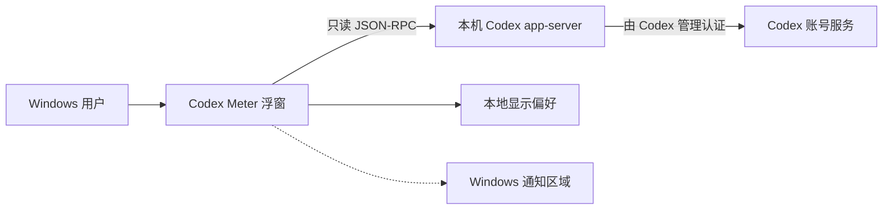

# Codex Meter

<p align="center">
  
</p>

Codex Meter 是一款面向 Windows 11 的 Codex 配额桌面浮窗。它通过本机
Codex `app-server` 读取只读配额数据，以同等视觉优先级展示 5 小时额度、
一周额度、重置时间和可用完整重置次数。

> [!IMPORTANT]
> 本项目是非官方社区工具，与 OpenAI 或 ChatGPT 无隶属、赞助或背书关系。
> 当前仓库尚未添加项目级 `LICENSE`；在选择并提交许可证前，它可以公开查看，
> 但不应被描述为已获得开源许可。


## ✨ 功能

- 5 小时与一周配额并列显示，不弱化任一时间窗口。
- 剩余百分比与舱内液体体积线性对应。
- 拖动窗口时具有窗口惯性与独立液体晃动；释放后液体继续阻尼回摆。
- 支持紧凑、展开、折叠、加载和失败状态。
- 无普通任务栏按钮，通过 Windows 通知区域图标显示、隐藏或退出。
- 手动启动，不注册开机启动项、计划任务或后台服务。
- 支持刷新、限时鼠标穿透、透明度和“减少动态效果”设置。
- 错误状态提供可操作提示和稳定诊断码。

## 🔒 数据与隐私边界

Codex Meter 只启动一个独立的本机 Codex `app-server` 进程，并读取其账号配额
接口。它不会附加到 Codex Desktop 的私有标准输入输出，不读取进程内存、
浏览器 Cookie 或登录令牌，也不会兑换完整重置次数或修改账号状态。Codex 的
登录和网络通信仍由官方 Codex 运行时负责。[^codex-app-server]

应用仅在当前 Windows 用户目录中保存透明度、动效偏好等显示设置。项目源码
不需要 `.env`、API Key 或个人访问令牌。



## 🖥️ 运行要求

- Windows 11 x64。
- 同一 Windows 用户已登录 Codex。
- 便携目录中的 `Codex Meter.exe`、`codex-runtime` 和
  `webview2-runtime` 必须保持在一起。

便携包使用固定版本 WebView2 Runtime，因此不依赖机器上预装的 WebView2。
开发环境仍需 Node.js、Rust MSVC 工具链和 Tauri 2 所需的 Windows 构建组件；
具体前置条件见 Tauri 官方文档。[^tauri-prerequisites]

## 🚀 使用便携版

1. 解压完整的 Codex Meter 便携包。
2. 确认 `codex-runtime` 与 `webview2-runtime` 位于 EXE 同级目录。
3. 双击 `Codex Meter.exe`。
4. 从浮窗顶部拖动窗口；点击右下角箭头展开详细信息。
5. 关闭浮窗只会隐藏到通知区域；从托盘菜单选择“退出”才会结束程序。

项目当前没有安装器和自动更新器。发布二进制文件前，请同时遵守
[`THIRD_PARTY_NOTICES.md`](THIRD_PARTY_NOTICES.md) 中各运行时的再分发条款。

## 🛠️ 从源码开发

在已安装 Node.js、Rust 和 Windows MSVC 构建工具的 PowerShell 中运行：

```powershell
npm.cmd ci
npm.cmd run tauri:dev
```

常用检查：

```powershell
npm.cmd run typecheck
npm.cmd run test
npm.cmd run build
cargo clippy --manifest-path src-tauri\Cargo.toml --all-targets -- -D warnings
cargo test --manifest-path src-tauri\Cargo.toml
```

本项目已验证的环境基线为 Node.js 24.18.0、Rust 1.97.1、Tauri 2.11.5、
`@openai/codex` 0.147.0 和 WebView2 Fixed Runtime 151.0.4129.78；这些是
可复现基线，不代表最低兼容版本。

## 📦 构建便携包

首次构建先下载并校验固定版本 WebView2 Runtime：

```powershell
powershell.exe -NoProfile -ExecutionPolicy Bypass `
  -File scripts\fetch-webview2-fixed-runtime.ps1
```

然后构建 Tauri 可执行文件并生成便携目录：

```powershell
npm.cmd run tauri:build
powershell.exe -NoProfile -ExecutionPolicy Bypass `
  -File scripts\package-portable.ps1
powershell.exe -NoProfile -ExecutionPolicy Bypass `
  -File scripts\verify-portable-brand.ps1
```

输出位于 `release/CodexMeter-<版本>-win-x64/`。该目录包含约 1 GB 的运行时，
已被 Git 忽略；请将其压缩后作为 GitHub Release 附件发布，不要提交到源码历史。

## 🧱 技术架构

| 层 | 技术 | 职责 |
| --- | --- | --- |
| 桌面外壳 | Tauri 2 / Rust | 窗口、托盘、进程生命周期、Codex JSON-RPC |
| 界面 | React 19 / TypeScript / Vite | 配额状态、交互、设置与错误恢复 |
| 材质与动效 | WebGL2 / GLSL | 光学舱体、体积液体、折射与惯性 |
| 数据源 | `@openai/codex` | 独立本机 `app-server` 与账号配额接口 |
| 渲染运行时 | Microsoft Edge WebView2 | Windows WebView 渲染 |

OpenAI 将 `codex app-server` 用于驱动丰富界面，并提供版本对应的协议定义；
该接口仍可能随 Codex 版本演进，因此本项目固定并随包携带已验证的 Codex
运行时。[^codex-app-server]

## 📁 项目结构

```text
codex-meter/
├── src/                    # React 界面、WebGL 材质和前端测试
├── src-tauri/              # Rust 后端、Tauri 配置和应用图标
├── scripts/                # WebView2 下载、便携打包与品牌验证
├── docs/verification/      # 验证记录与证据
├── fixtures/               # 测试夹具
├── PRODUCT.md              # 产品合同与边界
├── DESIGN.md               # 已批准视觉和交互规范
└── THIRD_PARTY_NOTICES.md  # 第三方来源与许可说明
```

## ✅ 验证状态

最近一次完整记录的状态为 `Acceptance pending`：自动检查通过，仍待目标用户
环境验收。记录覆盖 React 状态与交互测试、Rust 集成测试、真实便携包启动、
无控制台黑框、无任务栏按钮、关闭到托盘、窗口拖动惯性、液体释放后运动和
五种视觉状态。

详细命令、环境、实际结果、截图和已知限制见
[`docs/verification/VERIFICATION.md`](docs/verification/VERIFICATION.md)。历史记录
不替代当前提交上的复测。

## 🤝 参与贡献

提交 Issue 或 Pull Request 前，请先阅读：

- [`AGENTS.md`](AGENTS.md)：项目开发和真实交付纪律。
- [`PRODUCT.md`](PRODUCT.md)：首期范围、用户旅程与明确不做的内容。
- [`DESIGN.md`](DESIGN.md)：液态玻璃、体积液体和动效合同。
- [`THIRD_PARTY_NOTICES.md`](THIRD_PARTY_NOTICES.md)：第三方来源与许可边界。

修复回归时请提供可重复步骤；涉及 UI 的修改必须先更新设计图并获批，再在
真实 Tauri/WebView2 产物中截图对照。请勿在公开 Issue 中提交令牌、日志、
账号截图或其他敏感数据。

## 🗺️ 当前范围

首期明确不包含：

- 开机自动启动。
- 配额历史、分析图表或通知系统。
- 自动兑换完整重置次数。
- 安装器、自动更新器和代码签名。
- macOS、Linux 或其他 AI 提供商支持。

## 📜 许可证

当前仓库没有项目级 `LICENSE`，因此尚未完成开源授权。公开发布前，项目所有者
需要选择并提交许可证；`THIRD_PARTY_NOTICES.md` 仅记录第三方条款，不能替代
项目自身许可证。

仓库还包含用于开发的 Impeccable 设计技能快照。其上游以 Apache-2.0 发布，
正式公开前应确保仓库保留上游 `LICENSE` 与 `NOTICE` 要求。[^impeccable]

## 🙏 致谢

- [OpenAI Codex](https://github.com/openai/codex)：本机 Codex 运行时和
  `app-server` 协议。
- [Tauri](https://github.com/tauri-apps/tauri)：Windows 桌面外壳。
- [WebGL Fluid Simulation](https://github.com/PavelDoGreat/WebGL-Fluid-Simulation)：
  流体运动参考。
- [Canvas UI](https://github.com/DavidHDev/canvas-ui)：光学玻璃材质参考。
- [Impeccable](https://github.com/pbakaus/impeccable)：设计工作流与质量检查。

完整归属与许可链接见 [`THIRD_PARTY_NOTICES.md`](THIRD_PARTY_NOTICES.md)。

## 📚 发布指南

仓库当前未配置 Git 远程地址，本项目也不会自动上传源码。清理历史、选择项目
许可证并完成本地复测后，由项目所有者按照
[`docs/GITHUB_PUBLISH.md`](docs/GITHUB_PUBLISH.md) 手动创建和推送 GitHub 仓库。

[^codex-app-server]: [OpenAI Codex `app-server` 官方文档](https://github.com/openai/codex/blob/main/codex-rs/app-server/README.md)
[^tauri-prerequisites]: [Tauri 2 Windows 前置条件](https://v2.tauri.app/start/prerequisites/#windows)
[^impeccable]: [Impeccable 上游仓库与 Apache-2.0 许可](https://github.com/pbakaus/impeccable)
